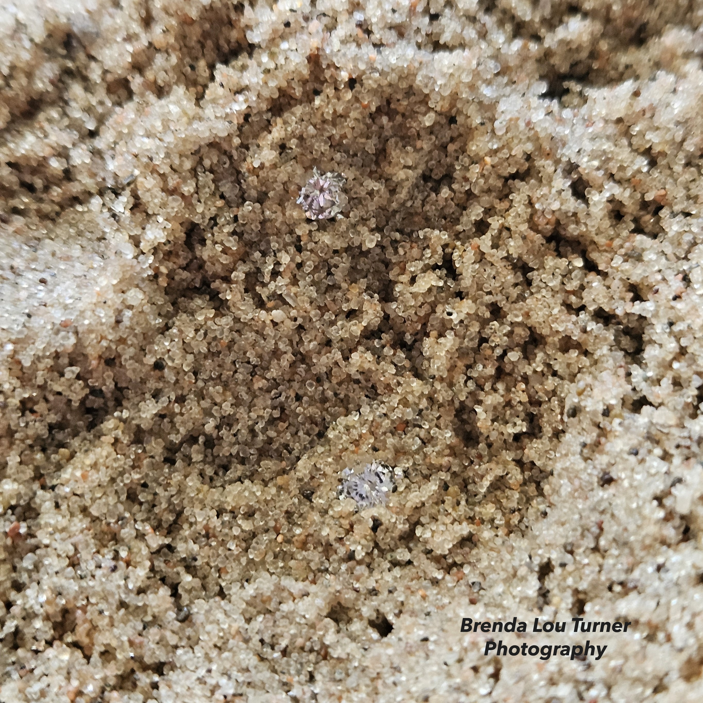

# DiamondsDenovo

#### Laboratory of Tychele N. Turner, Ph.D.
#### Washington University in St. Louis



The goal of this tool is to find "diamonds in the rough" in the genome. It is used to identify regions of the genome with an excess of *de novo* variants. There are two parts of the tool. The first is a script (`genomic_mutation_rate.py`) to generate mutation rates to use as priors for assessing *de novo* variants. This tool calculates mutation rates directly, by comparing between two genomes with known divergence times. It can optionally provide a weighted mutation rate that integrates other features (i.e., CADD scores). The second is a script (`diamonds.R`) to generate p-values for *de novo* variants in a given set of regions in the genome.

#### Install of Required Python packages for `genomic_mutation_rate.py`
```
argparse
pyliftover
Bio
numpy
pyBigWig
```

#### Other Software Used Internally in the Script
```
mafft
```

#### Required External Resource Files and Initial Setup

Reference Genomes (it is imperative that these are uncompressed when running `genomic_mutation_rate.py` as our extensive benchmarking showed that the script runs extremely fast using the uncompressed files and the compressed version is much slower for processing times). In the example below, comparisons are made between hg38 and panTro6. However, any two genomes can be used if the reference genomes exist, a liftOver chain file exists, and the divergence time is known.
```
wget https://hgdownload.soe.ucsc.edu/goldenPath/hg38/bigZips/hg38.fa.gz
wget https://hgdownload.soe.ucsc.edu/goldenPath/panTro6/bigZips/panTro6.fa.gz

gunzip hg38.fa.gz
gunzip panTro6.fa.gz
```

Genome Conversions (liftover chain files)
```
wget http://hgdownload.cse.ucsc.edu/gbdb/hg38/liftOver/hg38ToPanTro6.over.chain.gz
```

CADD Scores
```
wget https://krishna.gs.washington.edu/download/CADD/bigWig/CADD_GRCh38-v1.7.bw
```

#### Arguments for `genomic_mutation_rate.py`

Please note that the `--combined_output_file` flag can be used to combine metrics across regions. For example, if you want to look at the mutation rate across all enhancers of a gene, you could put them in one bed file and the output would be two files: one with the rates for each enhancer and one with the combined rate.
```
options:
  -h, --help            show this help message and exit
  -b BED_FILE, --bed_file BED_FILE
                        Input BED file with human genomic coordinates
  -c CHAIN_FILE, --chain_file CHAIN_FILE
                        Chain file for LiftOver
  -hf HUMAN_FASTA, --human_fasta HUMAN_FASTA
                        Human reference genome FASTA file
  -cf OTHER_FASTA, --other_fasta OTHER_FASTA
                        Other reference genome FASTA file
  -d DIVERGENCE_TIME, --divergence_time DIVERGENCE_TIME
                        Divergence time
  -p CADD_FILE, --cadd_file CADD_FILE
                        CADD bigWig file
  -o OUTPUT_FILE, --output_file OUTPUT_FILE
                        Output file to save mutation rates
  --combined_output_file COMBINED_OUTPUT_FILE
                        Optional output file to save combined metrics
```

#### Example (identify the mutation rate across the hs737 enhancer)
```
python3 genomic_mutation_rate.py -b example/hs737.bed -c hg38ToPanTro6.over.chain.gz -hf hg38.fa -cf panTro6.fa -d 6e6 -p CADD_GRCh38-v1.7.bw -o hs737.mutation.rate.txt
```

#### Install of Required R packages for `diamonds.R`
```
optparse
rtracklayer
GenomicRanges
qqman
```
___

#### Arguments for `diamonds.R`
```
Options:
	-r REGIONS, --regions=REGIONS
		bed file of regions of interest

	-d DNV, --dnv=DNV
		de novo variants in a bed file

	-p PRIOR, --prior=PRIOR
		Prior file generated from genomic_mutation_rate.py

	-n NINDIVIDUALS, --nIndividuals=NINDIVIDUALS
		number of individuals

	-m MANHATTAN, --manhattan=MANHATTAN
		manhattan plot pdf name

	-o OUTPUT, --output=OUTPUT
		Output text file name
```

#### Example of testing p-value across hs737

##### No weights
```
Rscript diamonds.R \
-r example/hs737.bed \
-d example/hs737_dnvs.bed \
-p example/hs737.mutation.rate.txt \
-n 2671 \
-m hs737_test_no_weight.pdf \
-o hs737_test_no_weight.txt
```

##### Weights from CADD scores
```
Rscript diamonds.R \
-r example/hs737.bed \
-d example/hs737_dnvs.bed \
-p example/hs737.mutation.rate.txt \
-w yes \
-n 2671 \
-m hs737_test_weights.pdf \
-o hs737_weights.txt
```
___

#### Another example is comparisons with fugu. For this comparison use the files below and a divergence time of `450e6`
```
wget https://hgdownload.soe.ucsc.edu/goldenPath/fr3/bigZips/fr3.fa.gz
gunzip fr3.fa.gz

wget https://hgdownload.cse.ucsc.edu/goldenpath/hg38/liftOver/hg38ToFr3.over.chain.gz
```